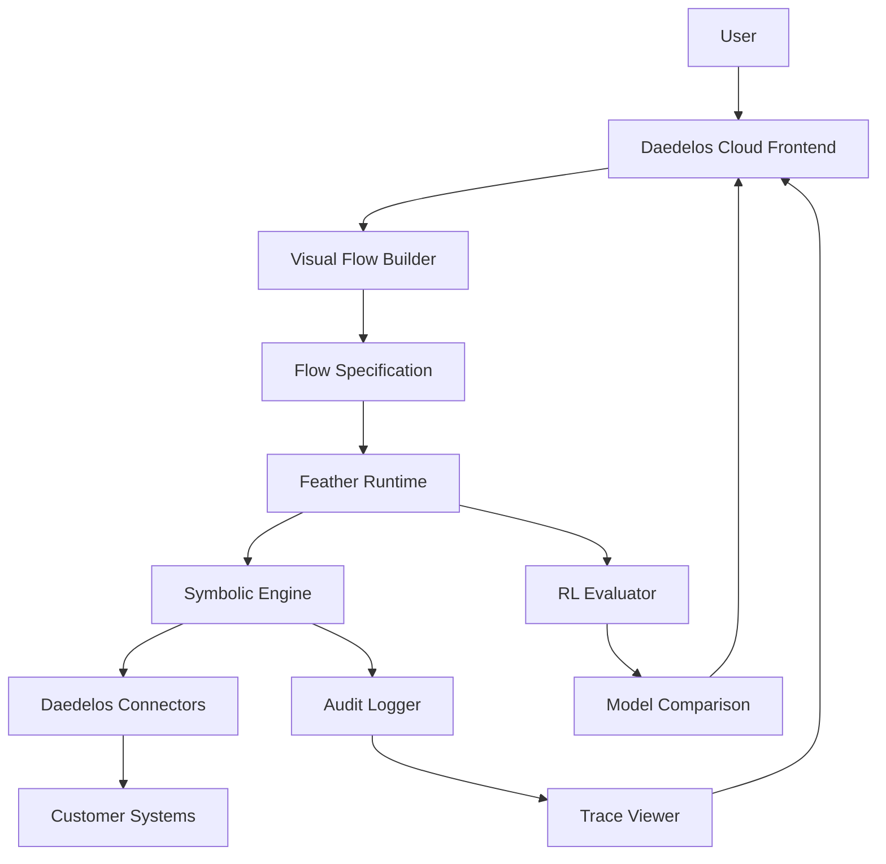

# 🐉 Daedelos Systems — Explainable AI Infrastructure

**Daedelos Systems** is an enterprise platform for building, deploying, and governing **symbolic + LLM hybrid AI systems**. It enables organizations to codify their internal reasoning processes into secure, auditable logic — transforming opaque AI decisions into **transparent, traceable outcomes**.

Daedelos is built atop the **Feather Agent Framework** and uses **Daedelos Cloud**, **Feather Runtime**, and **Daedelos Connectors** to orchestrate symbolic reasoning, LLM comparison, and reinforcement learning in real-time.

---

## 🧠 Mission

> **Daedelos's mission** is to make enterprise AI explainable, secure, and composable — where every decision can be audited, reasoned about, and improved.

Most AI pilots fail because they lack:
- **Explainability** — Can't understand how decisions are made
- **Governance** — No oversight or compliance controls  
- **Integration** — Doesn't work with existing systems

Daedelos solves this by combining **symbolic AI** (explicit logic) with **LLM reasoning** (pattern-based inference) inside a unified drag-and-drop environment.

---

## ⚙️ Core Components

| Component | Description |
|------------|-------------|
| **Daedelos Cloud** | SaaS control plane and visual builder (Next.js + ReactFlow) |
| **Feather Runtime** | Customer-side execution engine (Node.js / Docker) |
| **Daedelos Connectors** | Secure adapters for APIs, databases, and systems |
| **Symbolic Engine** | JSONLogic-based interpreter with audit trace |
| **RL Evaluator** | Compares LLM outputs vs. symbolic truth for reinforcement |
| **Audit Layer** | Cryptographically signed trace logs for compliance |

---

## 🧩 Architecture Overview



**Daedelos Cloud** never handles raw customer data — only metadata and hashes of symbolic evaluations.

---

## 🧰 Quick Start

### Prerequisites
- Node.js ≥ 20
- Docker & Docker Compose
- pnpm (preferred) or npm/yarn
- PostgreSQL (for audit logs)

### Clone Repository
```bash
git clone https://github.com/Geddydukes/Daedelos-systems.git
cd Daedelos-systems
pnpm install
```

### Run Local Development Stack
```bash
# Launch Daedelos Cloud
pnpm run dev

# Launch Feather Runtime (sandbox)
docker compose up feather-runtime
```

Visit http://localhost:3000 to access Daedelos Cloud.

---

## 📂 Complete Documentation

All comprehensive documentation is organized in the [`/docs`](docs/) folder:

### Core Platform Documentation
- **[Compatibility Layer](docs/01_Compatibility_Layer.md)** — Unified compatibility layer & frontend integration
- **[Framework Customizations](docs/02_Framework_Customizations.md)** — Unified framework architecture & frontend integration  
- **[Platform Architecture](docs/03_Platform_Architecture.md)** — Complete platform architecture & extensions
- **[Implementation Guide](docs/04_Implementation_Guide.md)** — Complete implementation guide with phases
- **[Migration Plan](docs/05_Migration_Plan.md)** — Complete platform migration plan
- **[Testing Strategy](docs/06_Testing_Strategy.md)** — Comprehensive testing strategy

### Frontend Documentation
- **[Frontend Development Plan](docs/07_Frontend_Development_Plan.md)** — Frontend development phases and roadmap
- **[User Flow](docs/08_User_Flow.md)** — Complete user journey and workflow
- **[Frontend System Architecture](docs/09_Frontend_System_Architecture.md)** — Frontend system architecture
- **[Frontend README](docs/10_Frontend_README.md)** — Frontend overview and quick start

### Framework Documentation
- **[API Reference](docs/api-reference.md)** — Feather-agent API reference
- **[Deployment](docs/deployment.md)** — Deployment guide
- **[Examples](docs/examples.md)** — Usage examples
- **[Quick Start](docs/quick-start.md)** — Quick start guide

**📖 [View Complete Documentation Index](docs/README.md)**

---

## 🔧 Example Workflow

1. **Create a Flow**
```yaml
flow:
  - fetch: crm.getCustomerData
  - rule: DSCR_MIN_1_20
  - if_pass: notify("Loan pre-approved")
  - if_fail: escalate("Manual review")
```

2. **Register a Connector**
```bash
docker run Daedelos-connector --token=$Daedelos_TOKEN
```

3. **Execute a Test**
```bash
curl -X POST localhost:8080/run \
  -H 'content-type: application/json' \
  -d '{"noi": 120000, "debt_service": 100000}'
```

**Response:**
```json
{
  "verdict": "PASS",
  "dscr": 1.2,
  "trace": ["Rule DSCR_MIN_1_20 met threshold"],
  "timestamp": "2025-10-20T18:22Z"
}
```

---

## 🔒 Security Model

| Layer | Responsibility | Mechanism |
|-------|---------------|-----------|
| Daedelos Cloud | Control plane only | TLS 1.3, OAuth2, RBAC |
| Feather Runtime | Execution sandbox | Docker isolation, ephemeral volumes |
| Connectors | Scoped data access | JWT auth, local logging |
| Audit Layer | Trace integrity | SHA-256 signed hashes |

**Sensitive data never leaves the customer's infrastructure.**  
Daedelos Cloud stores only job IDs, rule versions, and execution summaries.

---

## 🧠 Symbolic AI + LLM Reinforcement

Daedelos integrates LLM evaluation loops that compare symbolic outputs with generative model predictions:

1. **Symbolic reasoning** executes ground-truth rules
2. **LLM predicts** an outcome for the same case  
3. **Disagreements logged** as preference pairs
4. **Reinforcement Learning** (RLAIF or DPO) fine-tunes the model
5. **Over time**, LLM accuracy converges toward the symbolic baseline

This enables machine-verifiable reasoning that improves continuously.

---

## 📊 Observability

Daedelos emits OpenTelemetry-compatible structured logs:

```json
{
  "job_id": "abc123",
  "rule_id": "DSCR_MIN_1_20", 
  "result": "PASS",
  "value": 1.23,
  "runtime": 45,
  "timestamp": "2025-10-20T10:45:12Z"
}
```

Supports exporters for:
- Datadog
- Grafana  
- ELK Stack
- S3 / Glacier Archival

---

## 🧱 Repository Structure

```
Daedelos-systems/
├── apps/
│   ├── Daedelos-cloud/         # Next.js SaaS frontend
│   └── feather-runtime/     # Node.js runtime engine
├── packages/
│   ├── symbolic-engine/     # JSONLogic interpreter + DSL compiler
│   ├── connectors/          # SDKs for APIs & databases
│   └── shared/              # Utils, schema validators, types
├── docs/                    # Complete documentation
├── tests/                   # Test suites
├── docker-compose.yml
└── README.md
```

---

## 🧩 Deployment Options

| Mode | Description | Example Users |
|------|-------------|---------------|
| **SaaS** | Daedelos Cloud hosts control plane; runtime external | Startups, SMBs |
| **Hybrid** | Cloud builder + on-prem Feather Runtime | Fintechs, Legaltech |
| **On-Prem** | Full stack deployed internally | Healthcare, Banking |

Deployment managed via Docker, Kubernetes, or Terraform.

---

## 🧭 Roadmap

| Phase | Milestone | Target |
|-------|-----------|--------|
| **Alpha** (Q4 2025) | Symbolic engine + Cloud builder | ✅ Complete |
| **Beta** (Q1 2026) | Hybrid deployment + audit system | In Progress |
| **v1.0 Launch** (Q2 2026) | Marketplace + RL loop | Planned |
| **v2.0** (2027) | Multi-agent orchestration & self-optimizing rules | Planned |

---

## 🧩 Example Use Cases

- **Finance**: Loan eligibility & credit risk engines
- **Legal**: Contract clause validation  
- **Healthcare**: Treatment protocol compliance
- **Manufacturing**: Safety check automation
- **GovTech**: Policy audit and decision justification

---

## 📈 Market Context

- **MIT Tech Review (2025)**: "95% of GenAI pilots fail to deliver ROI."
- **S&P Global (2025)**: "42% of firms abandon AI within a year due to poor governance."
- **Gartner (2025)**: "60% of AI projects will be canceled without explainability."
- **McKinsey (2025)**: "80% of enterprises will require AI audit layers by 2027."

Daedelos directly addresses these pain points by delivering explainable AI infrastructure as a product.

---

## 🤝 Contributing

Daedelos welcomes contributions from the open-source community.

### Development
```bash
pnpm run dev
pnpm run test
```

### Guidelines
- Use conventional commits (`feat:`, `fix:`, `chore:`)
- PRs must include updated tests and documentation
- Follow the Daedelos Code of Conduct

---

## 📜 License

Daedelos Systems © 2025 Geddy Dukes  
Licensed under the Elastic License 2.0 (ELv2).  
Commercial use available via Daedelos Cloud Enterprise.
```
