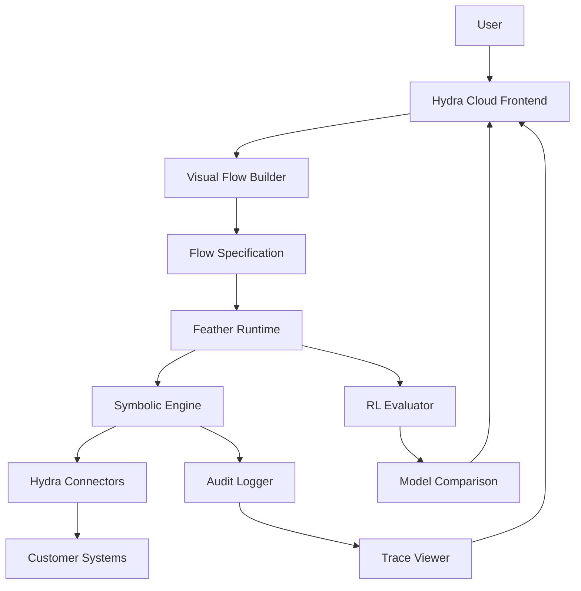

# Hydra Systems — Complete Platform Architecture & Extensions

## Overview

This document outlines the complete Hydra Systems platform architecture, integrating Hydra Cloud frontend, Feather Runtime backend, and Hydra Connectors into a unified enterprise solution. Instead of modifying the `feather-agent` framework itself, we create Hydra-specific enhancements as extensions and customizations within this repository, maintaining clean separation of concerns while providing specialized capabilities.

## Complete System Architecture

### Unified Platform Stack

The Hydra Systems platform consists of three integrated layers working together:

```typescript
// Complete Hydra Systems Platform Architecture
interface HydraSystemsPlatform {
  // Frontend Layer - Hydra Cloud
  hydraCloud: {
    visualBuilder: ReactFlowEditor;
    projectManagement: ProjectDashboard;
    connectorRegistry: ConnectorManager;
    auditDashboard: TraceViewer;
    rlEvaluator: ModelComparison;
    collaborationTools: RealTimeCollaboration;
  };
  
  // Backend Layer - Feather Runtime
  featherRuntime: {
    symbolicEngine: JSONLogicInterpreter;
    auditLogger: TraceGenerator;
    jobQueue: RedisQueue;
    sandboxExecutor: DockerContainer;
    deploymentManager: DeploymentManager;
  };
  
  // Integration Layer - Hydra Connectors
  hydraConnectors: {
    restConnectors: RESTAdapter[];
    dbConnectors: DatabaseAdapter[];
    customConnectors: CustomAdapter[];
    connectorGateway: ConnectorGateway;
  };
  
  // Security & Governance Layer
  securityModel: {
    oauth2Auth: OAuth2Provider;
    jwtTokens: JWTManager;
    rbacSystem: RoleBasedAccessControl;
    auditTrail: AuditLogger;
    complianceTools: ComplianceManager;
  };
}
```

### System Integration Flow



## 1. Complete Repository Structure

```
Hydra_system/
├── src/
│   ├── frontend/           # Hydra Cloud Frontend
│   │   ├── components/     # React components
│   │   │   ├── VisualEditor.tsx
│   │   │   ├── ProjectDashboard.tsx
│   │   │   ├── ConnectorRegistry.tsx
│   │   │   ├── AuditDashboard.tsx
│   │   │   └── RLComparator.tsx
│   │   ├── hooks/          # React hooks
│   │   │   ├── useFlowExecution.ts
│   │   │   ├── useRealTimeSync.ts
│   │   │   └── useProjectManagement.ts
│   │   ├── services/       # Frontend services
│   │   │   ├── HydraCloudService.ts
│   │   │   ├── FeatherRuntimeClient.ts
│   │   │   └── ConnectorGatewayClient.ts
│   │   └── utils/          # Frontend utilities
│   │       ├── FlowConverter.ts
│   │       ├── VisualTraceGenerator.ts
│   │       └── ProjectScaffolder.ts
│   ├── backend/            # Feather Runtime Backend
│   │   ├── agents/         # Hydra-specific agent implementations
│   │   │   ├── HydraAgent.ts
│   │   │   ├── RouterAgent.ts
│   │   │   ├── SELLMAgent.ts
│   │   │   ├── VisualBuilderAgent.ts
│   │   │   └── ProjectManagementAgent.ts
│   │   ├── registry/       # Teacher registry implementation
│   │   │   ├── TeacherRegistry.ts
│   │   │   ├── TeacherSpec.ts
│   │   │   └── VersionManager.ts
│   │   ├── watchers/       # Policy watcher system
│   │   │   ├── PolicyWatcher.ts
│   │   │   ├── ExternalWatcher.ts
│   │   │   └── ChangeAnalyzer.ts
│   │   ├── training/       # Training pipeline
│   │   │   ├── TrainingPipeline.ts
│   │   │   ├── DataProcessor.ts
│   │   │   └── DatasetGenerator.ts
│   │   ├── tools/          # Hydra-specific tools
│   │   │   ├── TeacherTools.ts
│   │   │   ├── DSCRTeacher.ts
│   │   │   └── TransferTaxTeacher.ts
│   │   └── runtime/        # Feather Runtime core
│   │       ├── SymbolicEngine.ts
│   │       ├── AuditLogger.ts
│   │       ├── JobQueue.ts
│   │       └── SandboxExecutor.ts
│   ├── connectors/         # Hydra Connectors
│   │   ├── rest/           # REST API connectors
│   │   │   ├── CRMConnector.ts
│   │   │   ├── ERPConnector.ts
│   │   │   └── HRISConnector.ts
│   │   ├── database/       # Database connectors
│   │   │   ├── PostgreSQLConnector.ts
│   │   │   ├── MySQLConnector.ts
│   │   │   └── SnowflakeConnector.ts
│   │   ├── custom/         # Custom connectors
│   │   │   ├── PythonConnector.ts
│   │   │   └── NodeConnector.ts
│   │   └── gateway/        # Connector gateway
│   │       ├── ConnectorGateway.ts
│   │       ├── AuthManager.ts
│   │       └── ScopeValidator.ts
│   ├── compatibility/      # Migration compatibility layer
│   │   ├── HttpApiAdapter.ts
│   │   ├── PythonServiceClient.ts
│   │   ├── FeatureFlagManager.ts
│   │   └── HydraCloudAdapter.ts
│   └── shared/            # Shared utilities and types
│       ├── types/          # TypeScript type definitions
│       ├── schemas/        # JSON schemas
│       ├── utils/           # Shared utilities
│       └── constants/      # Constants and configurations
├── apps/                   # Application configurations
│   ├── hydra-cloud/        # Next.js SaaS frontend
│   │   ├── pages/          # Next.js pages
│   │   ├── components/     # Page components
│   │   ├── styles/         # CSS and styling
│   │   └── next.config.js  # Next.js configuration
│   ├── feather-runtime/    # Node.js runtime engine
│   │   ├── Dockerfile      # Runtime container
│   │   ├── docker-compose.yml
│   │   └── k8s/            # Kubernetes manifests
│   └── connector-gateway/  # Connector gateway service
│       ├── Dockerfile
│       └── config/         # Gateway configuration
├── packages/               # Shared packages
│   ├── symbolic-engine/    # JSONLogic interpreter + DSL compiler
│   ├── connectors-sdk/     # SDKs for APIs & databases
│   ├── shared-ui/          # Shared UI components
│   └── shared-utils/       # Shared utilities
├── docs/                   # Documentation
│   ├── front-end-docs/     # Frontend documentation
│   │   ├── development-plan.md
│   │   ├── user-flow.md
│   │   ├── system-architecture.md
│   │   └── README.md
│   ├── api-reference/      # API documentation
│   ├── deployment/         # Deployment guides
│   └── examples/           # Usage examples
├── tests/                  # Test suites
│   ├── unit/               # Unit tests
│   ├── integration/        # Integration tests
│   ├── e2e/                # End-to-end tests
│   └── performance/        # Performance tests
├── docker-compose.yml      # Development environment
├── package.json            # Root package configuration
├── tsconfig.json           # TypeScript configuration
├── tailwind.config.js      # Tailwind CSS configuration
└── README.md               # Project overview
```

## 2. Hydra-Specific Extensions

### 2.1 HydraAgent Base Class (Extension of feather-agent Agent)

```typescript
// src/agents/HydraAgent.ts
import { Agent, AgentOpts } from 'feather-agent';
import { TeacherRegistry } from '../registry/TeacherRegistry';
import { PolicyWatcher } from '../watchers/PolicyWatcher';
import { TrainingPipeline } from '../training/TrainingPipeline';

export abstract class HydraAgent extends Agent {
  protected teacherRegistry: TeacherRegistry;
  protected policyWatcher: PolicyWatcher;
  protected trainingPipeline: TrainingPipeline;
  
  constructor(opts: HydraAgentOpts) {
    super(opts);
    this.teacherRegistry = opts.teacherRegistry;
    this.policyWatcher = opts.policyWatcher;
    this.trainingPipeline = opts.trainingPipeline;
  }
  
  // Hydra-specific lifecycle hooks
  protected async onTeacherExecution(teacherId: string, inputs: any, result: any): Promise<void> {
    await this.trainingPipeline.collectExecution(teacherId, inputs, result);
  }
  
  protected async onPolicyChange(change: PolicyChange): Promise<void> {
    await this.policyWatcher.handleChange(change);
  }
  
  abstract executeHydraTask(input: HydraTaskInput): Promise<HydraTaskResult>;
}

export interface HydraAgentOpts extends AgentOpts {
  teacherRegistry: TeacherRegistry;
  policyWatcher: PolicyWatcher;
  trainingPipeline: TrainingPipeline;
}
```

### 2.2 Teacher Registry (Standalone Implementation)

```typescript
// src/registry/TeacherRegistry.ts
import { Database } from 'pg';
import { Cache } from 'ioredis';

export class TeacherRegistry {
  private db: Database;
  private cache: Cache;
  
  constructor(opts: TeacherRegistryOpts) {
    this.db = opts.database;
    this.cache = opts.cache;
  }
  
  async getTeacher(teacherId: string, version?: string): Promise<TeacherSpec> {
    // Implementation using standard database and cache
    const key = `teacher:${teacherId}:${version || 'latest'}`;
    
    let teacher = await this.cache.get(key);
    if (teacher) {
      return JSON.parse(teacher);
    }
    
    teacher = await this.loadFromDatabase(teacherId, version);
    await this.cache.set(key, JSON.stringify(teacher), 'EX', 3600);
    
    return teacher;
  }
  
  async createTeacher(spec: TeacherSpec): Promise<string> {
    const version = await this.generateVersion(spec);
    const teacherId = `${spec.domain}/${spec.teacher_id}@${version}`;
    
    await this.db.query(
      'INSERT INTO teachers (id, spec, version, domain, created_at) VALUES ($1, $2, $3, $4, $5)',
      [teacherId, JSON.stringify(spec), version, spec.domain, new Date()]
    );
    
    await this.invalidateCache(spec.teacher_id);
    return teacherId;
  }
  
  private async loadFromDatabase(teacherId: string, version?: string): Promise<TeacherSpec> {
    const result = await this.db.query(
      'SELECT spec FROM teachers WHERE teacher_id = $1 AND version = $2',
      [teacherId, version || 'latest']
    );
    
    if (result.rows.length === 0) {
      throw new Error(`Teacher ${teacherId} not found`);
    }
    
    return JSON.parse(result.rows[0].spec);
  }
}
```

### 2.3 Policy Watcher (Standalone Implementation)

```typescript
// src/watchers/PolicyWatcher.ts
import { EventEmitter } from 'events';
import { TeacherRegistry } from '../registry/TeacherRegistry';
import { SELLMAgent } from '../agents/SELLMAgent';

export class PolicyWatcher extends EventEmitter {
  private watchers: Map<string, WatcherInstance> = new Map();
  private teacherRegistry: TeacherRegistry;
  private sellmAgent: SELLMAgent;
  
  constructor(opts: PolicyWatcherOpts) {
    super();
    this.teacherRegistry = opts.teacherRegistry;
    this.sellmAgent = opts.sellmAgent;
  }
  
  async startWatching(config: WatcherConfig): Promise<void> {
    const watcher = new ExternalWatcher(config);
    
    watcher.on('change', async (change: PolicyChange) => {
      await this.handlePolicyChange(change);
    });
    
    this.watchers.set(config.id, watcher);
    await watcher.start();
  }
  
  private async handlePolicyChange(change: PolicyChange): Promise<void> {
    const affectedTeachers = await this.findAffectedTeachers(change);
    
    for (const teacher of affectedTeachers) {
      const patch = await this.generatePatch(teacher, change);
      await this.createChangeReport(teacher, change, patch);
    }
  }
  
  private async generatePatch(teacher: TeacherSpec, change: PolicyChange): Promise<TeacherPatch> {
    // Use SELLM agent to generate patch
    const result = await this.sellmAgent.run({
      sessionId: `patch-generation-${change.id}`,
      input: {
        role: "user",
        content: `Generate patch for teacher ${teacher.teacher_id} based on policy change: ${JSON.stringify(change)}`
      }
    });
    
    return result.output?.patch;
  }
}
```

## 3. Main Application (Using Standard feather-agent)

```typescript
// src/app.ts
import { Feather, Agent, InMemoryMemoryManager, createJsonPlanner } from 'feather-agent';
import { RouterAgent } from './agents/RouterAgent';
import { SELLMAgent } from './agents/SELLMAgent';
import { TeacherRegistry } from './registry/TeacherRegistry';
import { PolicyWatcher } from './watchers/PolicyWatcher';
import { TrainingPipeline } from './training/TrainingPipeline';

export class HydraApplication {
  private feather: Feather;
  private routerAgent: RouterAgent;
  private sellmAgent: SELLMAgent;
  private teacherRegistry: TeacherRegistry;
  private policyWatcher: PolicyWatcher;
  private trainingPipeline: TrainingPipeline;
  
  constructor() {
    // Use standard feather-agent
    this.feather = new Feather({
      providers: {
        llm: openai({ apiKey: process.env.OPENAI_API_KEY! }),
        teachers: createTeacherProvider()
      },
      limits: {
        "llm:gpt-4": { rps: 10, burst: 20 },
        "teachers:*": { rps: 100, burst: 200 }
      }
    });
    
    // Initialize Hydra-specific components
    this.teacherRegistry = new TeacherRegistry({
      database: new Database(process.env.DATABASE_URL!),
      cache: new Redis(process.env.REDIS_URL!)
    });
    
    this.policyWatcher = new PolicyWatcher({
      teacherRegistry: this.teacherRegistry,
      sellmAgent: this.sellmAgent
    });
    
    this.trainingPipeline = new TrainingPipeline({
      feather: this.feather,
      teacherRegistry: this.teacherRegistry
    });
    
    // Create Hydra-specific agents
    this.routerAgent = new RouterAgent({
      id: "hydra-router",
      planner: createJsonPlanner({
        callModel: async ({ messages }) => {
          const response = await this.feather.chat({
            provider: "llm",
            model: "gpt-4",
            messages,
            temperature: 0.1
          });
          return response.content;
        },
        tools: [
          { name: "execute_teacher", description: "Execute symbolic teacher" },
          { name: "create_teacher", description: "Generate new teacher" }
        ]
      }),
      memory: new InMemoryMemoryManager(),
      tools: [
        createTeacherTool(this.teacherRegistry),
        createLLMReasoningTool(this.feather)
      ],
      teacherRegistry: this.teacherRegistry,
      policyWatcher: this.policyWatcher,
      trainingPipeline: this.trainingPipeline
    });
    
    this.sellmAgent = new SELLMAgent({
      id: "symbolic-engineer",
      planner: createJsonPlanner({
        callModel: async ({ messages }) => {
          const response = await this.feather.chat({
            provider: "llm",
            model: "gpt-4",
            messages,
            temperature: 0.1
          });
          return response.content;
        },
        tools: [
          { name: "generate_teacher_spec", description: "Generate teacher specification" },
          { name: "generate_teacher_code", description: "Generate teacher implementation" },
          { name: "generate_tests", description: "Generate test cases" }
        ]
      }),
      memory: new InMemoryMemoryManager(),
      tools: [
        createGenerateTeacherSpecTool(),
        createGenerateTeacherCodeTool(),
        createGenerateTestsTool()
      ],
      teacherRegistry: this.teacherRegistry,
      policyWatcher: this.policyWatcher,
      trainingPipeline: this.trainingPipeline
    });
  }
  
  async start(): Promise<void> {
    // Start policy watchers
    await this.policyWatcher.startWatching();
    
    // Start HTTP server
    await this.startHttpServer();
    
    console.log("Hydra application started successfully");
  }
}
```

## 4. Package Dependencies

```json
// package.json
{
  "name": "hydra-agent",
  "version": "1.0.0",
  "dependencies": {
    "feather-agent": "^1.0.0",
    "express": "^4.18.0",
    "pg": "^8.11.0",
    "ioredis": "^5.3.0",
    "zod": "^3.22.0",
    "axios": "^1.6.0"
  },
  "devDependencies": {
    "typescript": "^5.0.0",
    "vitest": "^1.0.0",
    "@types/node": "^20.0.0",
    "@types/express": "^4.17.0",
    "@types/pg": "^8.10.0"
  }
}
```

## 5. Benefits of This Approach

### ✅ **Advantages:**
- **No Framework Modification**: Keep feather-agent as-is
- **Clean Separation**: Hydra-specific code in this repo
- **Easy Updates**: Can update feather-agent independently
- **Maintainable**: Clear boundaries between framework and application
- **Reusable**: Other projects can use feather-agent without Hydra-specific code

### 🔧 **Implementation Strategy:**
1. **Install feather-agent** as a dependency
2. **Extend Agent class** for Hydra-specific functionality
3. **Create custom tools** for teachers and other components
4. **Implement registry/watchers** as standalone modules
5. **Use standard feather-agent** for orchestration and LLM management

### 📁 **File Organization:**
- **`src/agents/`**: Hydra-specific agent implementations extending feather-agent
- **`src/registry/`**: Teacher registry and versioning system
- **`src/watchers/`**: Policy change detection and handling
- **`src/training/`**: Training data collection and processing
- **`src/tools/`**: Custom tools for teachers and other components
- **`src/compatibility/`**: Migration compatibility layer

This approach gives you all the benefits of the enhanced agent framework while keeping the implementation clean and maintainable. You can customize everything you need for Hydra without touching the core feather-agent framework.
